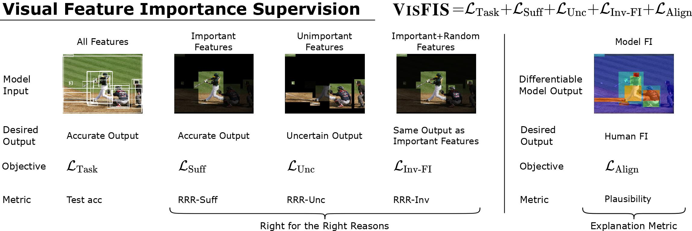

# VisFIS

VisFIS: Improved Visual Feature Importance Supervision with Right-for-Right-Reason Objectives

Zhuofan Ying*, Peter Hase*, Mohit Bansal



## Setup environment and data
### Environment
Create and activate conda environment:
```bash
conda create -n visfis python=3.6
conda activate visfis
```
Install the dependencies with:
```bash
pip install -r requirements.txt
```
### Setup data
- Download [gdrive](https://github.com/prasmussen/gdrive) to `path_to_gdrive` for running the scripts. Alternatively, you can also download data from [google drive](https://drive.google.com/drive/folders/11MF3H7UZfBUvL8kMtGsXqvPJHNNnhsrb?usp=sharing) manually.
- Inside `scripts/common.sh`, edit `PROJ_DIR` variable by assigning it the project path.
#### For CLEVR-XAI 
Download data for XAI-CP (put `path_to_gdrive` as the first argument):
```bash
./scripts/download/download_xai.sh ${path_to_gdrive}
```
Preprocess the data:
```bash
./scripts/preprocessing/preprocessing_xai.sh
```
#### For VQA-HAT
Download data for HAT-CP (put `path_to_gdrive` as the first argument):
```bash
./scripts/download/download_vqa.sh ${path_to_gdrive}
```
Preprocess the data:
```bash
./scripts/preprocessing/preprocessing_vqa.sh
```
#### For GQA
Download data for GQA-CP (put `path_to_gdrive` as the first argument):
```bash
./scripts/download/download_gqa.sh ${path_to_gdrive}
```
Preprocess the data:
```bash
./scripts/preprocessing/preprocessing_gqa.sh
```

## Training and Testing
- Run scripts in `scripts/baseline/`, and `scripts/visfis/` to train models and calculate metrics. Put dataset name as the first argument chosen from `xaicp`, `hatcp`, and `gqacp`. Put GPU number as the second argument. For example, to reproduce results from the main table on `xaicp`, execute: 
```bash
./scripts/baseline/baseline_updn.sh xaicp 0
./scripts/visfis/visfis_updn.sh xaicp 1
```
- To train with random supervision, change the value of `--hint_type` parameter in scripts to `hints_random`.
- Scripts for tuning and reproducing other SOTA results can be found in `scripts/all/`.

## Data Analysis
The `analysis/` directory contains R scripts that read `.pkl` files of metrics and conduct data analysis.

## Acknowledgement
This code used resources from [negative analysis of grounding](https://github.com/erobic/negative_analysis_of_grounding), [ramen](https://github.com/erobic/ramen), and [bottom-up-attention-vqa
](https://github.com/hengyuan-hu/bottom-up-attention-vqa). 


## License

MIT
